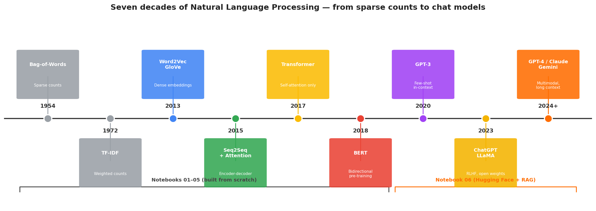

<div align="center">

# Natural Language Processing from Scratch

### A hands-on, didactic journey from Bag-of-Words to modern Large Language Models — implemented in PyTorch and Hugging Face.

[](https://www.python.org/downloads/)
[](https://pytorch.org/)
[](https://huggingface.co/docs/transformers)
[](LICENSE)
[](https://colab.research.google.com/github/alefonsecabb/Natural-Language-Processing-from-scratch)

</div>

---

## TL;DR

This repository walks through **seven decades of Natural Language Processing**, one notebook at a time. Every classical and modern technique — from sparse Bag-of-Words to multi-head self-attention to Retrieval-Augmented Generation — is **built from scratch in PyTorch** before being compared with the modern Hugging Face equivalent on the **IMDB sentiment dataset**. The goal is to make the leap from *"I have heard of BERT"* to *"I can read the BERT paper and re-implement any block of it"* a concrete, reproducible journey.



---

## Why this repository

I built this repo while studying NLP during the 5th semester of my **Data Science** undergraduate program at FATEC (São Paulo, Brazil). It started as a way to consolidate my coursework — but quickly became something I wanted to share, implement it cleanly, and explain *why* it works.

Every notebook in this repo is **self-contained**, **runnable end-to-end**, and **annotated in English** with the same level of care I would put into production code.

If you are a fellow learner: I hope the progression `BoW → Embeddings → Self-Attention → BERT → LLMs` makes the field click for you the way it did for me.

---

## The six notebooks

| # | Notebook | Techniques | Dataset | Open |
|---|----------|-----------|---------|------|
| 01 | [Tokenization, Bag-of-Words and a first Neural Network](notebooks/01_tokenization_bow_neural_networks.ipynb) | Regex tokenization, boolean & frequency BoW, TF-IDF, linear SVM, feed-forward NN | IMDB (sample + full) | [](https://colab.research.google.com/github/alefonsecabb/Natural-Language-Processing-from-scratch/blob/main/notebooks/01_tokenization_bow_neural_networks.ipynb) |
| 02 | [Word Embeddings](notebooks/02_word_embeddings.ipynb) | `nn.Embedding`, BoW-vs-Embedding equivalence proof, Neptune logging | IMDB (full) | [](https://colab.research.google.com/github/alefonsecabb/Natural-Language-Processing-from-scratch/blob/main/notebooks/02_word_embeddings.ipynb) |
| 03 | [Self-Attention from scratch](notebooks/03_self_attention.ipynb) | Scaled dot-product, loop + matrix implementations, frozen GloVe | IMDB (full) | [](https://colab.research.google.com/github/alefonsecabb/Natural-Language-Processing-from-scratch/blob/main/notebooks/03_self_attention.ipynb) |
| 04 | [BERT for sentiment analysis](notebooks/04_bert_transformer.ipynb) | Hugging Face BERT, custom training loop, gradient accumulation, mixed precision | IMDB (full) | [](https://colab.research.google.com/github/alefonsecabb/Natural-Language-Processing-from-scratch/blob/main/notebooks/04_bert_transformer.ipynb) |
| 05 | [Complete *Attention Is All You Need* block (extra)](notebooks/05_complete_self_attention_extra.ipynb) | Positional embeddings, W_Q/W_K/W_V/W_O, multi-head, LayerNorm, residuals, FFN | IMDB (full) | [](https://colab.research.google.com/github/alefonsecabb/Natural-Language-Processing-from-scratch/blob/main/notebooks/05_complete_self_attention_extra.ipynb) |
| 06 | [Modern LLMs: Hugging Face, GPT, RAG](notebooks/06_modern_llms_huggingface.ipynb) | `pipeline` API, fine-tuning DistilBERT, zero-shot, decoder-only generation, RAG with FAISS | IMDB + synthetic | [](https://colab.research.google.com/github/alefonsecabb/Natural-Language-Processing-from-scratch/blob/main/notebooks/06_modern_llms_huggingface.ipynb) |

> **Why this order?** Each notebook ends where the next one begins. Bag-of-Words sets up the sentiment task and a strong baseline; Embeddings rephrase that baseline in a dense space; Self-Attention generalises the embedding aggregation; BERT shows what self-attention looks like at scale; the Extra notebook fills in the architectural details glossed over by BERT; finally Notebook 06 hands you the modern Hugging Face stack so you can ship.

---

## Key concepts covered

<table>
<tr>
<td valign="top">

**Classical NLP**
- Regex tokenization
- Vocabulary construction
- Boolean Bag-of-Words
- Frequency Bag-of-Words
- TF-IDF
- Linear SVM classification

**Neural NLP**
- Dense word embeddings
- Mini-batch training
- Cross-entropy loss
- Train / val / test splits
- Mathematical equivalence between BoW-Freq and `Embedding + sum`

</td>
<td valign="top">

**The Attention era**
- Scaled dot-product attention
- Loop-based vs batched matrix implementation
- Multi-head attention
- Positional embeddings
- LayerNorm + residual connections
- Two-layer feed-forward block

**Modern NLP**
- Hugging Face `pipeline`, `Trainer`, `AutoModel*`
- Encoder vs decoder vs encoder-decoder families
- Fine-tuning DistilBERT
- Zero-shot classification with NLI
- Few-shot prompting
- Retrieval-Augmented Generation (RAG)

</td>
</tr>
</table>

---

## Results on IMDB

A consistent benchmark across the notebooks — same task, increasingly powerful approaches.

| Approach | Notebook | Accuracy (IMDB test) | Trainable params | Wall-clock training |
|---|---|---|---|---|
| Bag-of-Words boolean + SVM | 01 | ~80% | ~25k (support vectors) | <1 min CPU |
| BoW frequency + SVM | 01 | ~82% | ~25k | <1 min CPU |
| TF-IDF + SVM | 01 | ~83% | ~25k | ~3 min CPU |
| BoW + Feed-Forward NN | 01 | ~85% | ~3.2M | ~5 min GPU |
| Embedding + Sum + Linear | 02 | ~85% | ~3.2M | ~5 min GPU |
| Frozen GloVe + Self-Attention | 03 | ~80% | ~50k | ~10 min GPU |
| Frozen GloVe + Full Transformer block | 05 | ~81% | ~250k | ~15 min GPU |
| Fine-tuned `bert-base-uncased` | 04 | **~92%** | 110M (fine-tuned) | ~30 min on T4 |
| Fine-tuned `distilbert-base-uncased` | 06 | ~90% | 66M (fine-tuned) | ~5 min on T4 |

> **Take-away:** classical models reach a respectable 82–85% with almost no compute; pre-trained Transformers push the ceiling to 90%+ but only because somebody else paid for the pre-training. The right tool depends on your data, latency and budget.

---

## Setup

### Option 1 — Google Colab (recommended)

Every notebook has an **Open in Colab** badge above. Click, run, done. The free T4 GPU is enough for the entire repository.

### Option 2 — Local install

```bash
git clone https://github.com/alefonsecabb/Natural-Language-Processing-from-scratch.git
cd Natural-Language-Processing-from-scratch
python -m venv .venv
source .venv/bin/activate          # On Windows: .venv\Scripts\activate
pip install -r requirements.txt
jupyter lab
```

> A CUDA-capable GPU (8 GB+) is recommended for Notebooks 04, 05 and 06. The earlier notebooks run comfortably on CPU.

### The IMDB dataset

Notebooks 01 and 02 download the small `imdb_sample` and the full `aclImdb_v1.tar.gz` archive automatically. We **do not** version-control either — they total ~85 MB and are not the point of this repo.

---

## Repository layout

```text
Natural-Language-Processing-from-scratch/
├── README.md                                       <- you are here
├── LICENSE                                         <- MIT
├── requirements.txt                                <- exact pip dependencies
├── notebooks/
│   ├── 01_tokenization_bow_neural_networks.ipynb   <- BoW, TF-IDF, SVM, first NN
│   ├── 02_word_embeddings.ipynb                    <- dense embeddings
│   ├── 03_self_attention.ipynb                     <- attention from scratch
│   ├── 04_bert_transformer.ipynb                   <- fine-tuning BERT
│   ├── 05_complete_self_attention_extra.ipynb      <- full Transformer block
│   └── 06_modern_llms_huggingface.ipynb            <- Hugging Face + RAG
├── references/                                     <- the papers that inspired each notebook
│   ├── 01_foundations.pdf
│   ├── 03_embeddings.pdf
│   ├── 04_attention_is_all_you_need.pdf
│   └── 05_bert.pdf
└── assets/
    ├── generate_diagram.py                         <- regenerate the diagram above
    └── nlp_progression_diagram.png
```

---

## References

The papers in [`references/`](references/) are the originals that inspired each notebook.
Below are the canonical external links and a couple of *must-read* deep dives.

| Topic | Paper / Resource |
|---|---|
| Bag-of-Words distributional hypothesis | Harris, *Distributional Structure* (1954) |
| TF-IDF | Spärck Jones, *A Statistical Interpretation of Term Specificity* (1972) |
| Word2Vec | [Mikolov et al., 2013](https://arxiv.org/abs/1301.3781) |
| GloVe | [Pennington et al., 2014](https://nlp.stanford.edu/projects/glove/) |
| Seq2Seq + Attention | [Bahdanau et al., 2014](https://arxiv.org/abs/1409.0473) |
| **Transformer** | [Vaswani et al., 2017 — *Attention Is All You Need*](https://arxiv.org/abs/1706.03762) |
| **BERT** | [Devlin et al., 2018](https://arxiv.org/abs/1810.04805) |
| GPT-3 | [Brown et al., 2020](https://arxiv.org/abs/2005.14165) |
| Hugging Face Transformers | [Wolf et al., 2019](https://arxiv.org/abs/1910.03771) |
| RAG | [Lewis et al., 2020](https://arxiv.org/abs/2005.11401) |
| LLaMA | [Touvron et al., 2023](https://arxiv.org/abs/2302.13971) |

### Recommended next steps after this repo
- 📚 [The Hugging Face NLP Course](https://huggingface.co/course) — free, hands-on, excellent.
- 🛠️ [Andrej Karpathy — *Let's build GPT*](https://github.com/karpathy/nanoGPT) — 300 lines from token IDs to a trained transformer.
- 🎓 [Stanford CS224N](https://web.stanford.edu/class/cs224n/) — the canonical NLP course (lectures on YouTube).

---

## About the author

**Alexandre da Fonseca** — Data Science undergraduate at FATEC (São Paulo, Brazil),
5th semester. I enjoy turning research papers into reproducible notebooks and helping
others learn the *why* behind the *what*.

- 📧 [alefonsecabb@gmail.com](mailto:alefonsecabb@gmail.com)
- 💼 [github.com/alefonsecabb](https://github.com/alefonsecabb)

If this repository helped you, please ⭐ star it on GitHub — it really does help.

---

## License

This project is licensed under the [MIT License](LICENSE).
The PDFs in [`references/`](references/) belong to their respective authors and are
included here strictly for educational reference.
